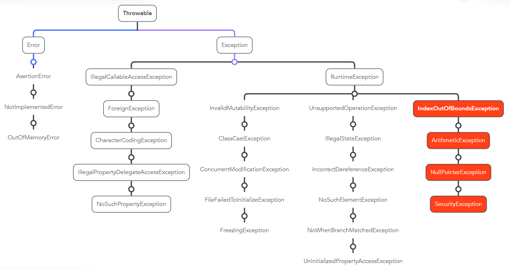

# Tema 12.Manejo de Excepciones

## EXCEPCIONES

### Definición y tipos

Las excepciones son situaciones anómalas que pueden ocurrir durante la ejecución de las aplicaciones, como por ejemplo:

* Intentar dar un tipo Int a una variable de tipo String.&#x20;
* En un Array tratar de acceder a un índice fuera de rango.

Las dos excepciones que se han puesto como ejemplo muestran los dos tipos de excepciones que podemos enfrentar en un lenguaje compilado como Kotlin:

#### Errores en tiempo de compilación

Los errores en tiempo de compilación, como su nombre indica, son aquellos que **suceden durante la compilación del programa**. En este caso, el programa no puede compilar debido a esos errores y, por tanto, no puede llegar a ejecutarse.

Se llaman también `errores sintácticos` ya que son los que implican errores en la escritura del código a nivel estructural, no de contenido. Por ejemplo:

```kotlin
// Asignar una String a una variable de tipo Int
var prueba: Int = "prueba"

// Genera un error en tiempo de compilación
Kotlin: Type mismatch: inferred type is String but Int was expected
```


Estos errores son marcados por el compilador como errores durante la escritura del código así que son fácilmente evitables.


#### Excepciones en tiempo de ejecución

Por el contrario, aunque el programa esté escrito de manera correcta y el compilador no arroje ningún error puede darse el caso de que se produzcan excepciones en tiempo de ejecución.

Estas excepciones se deben a errores en la implementación de la lógica del programa.

Todas las excepciones que existen heredan de la clase Exception que a su vez hereda de Throwable:

<figure><figcaption><p>Fuente: propia</p></figcaption></figure>


SecurityException es una clase de excepción heredada de Java pero es muy común en las aplicaciones de Android escrritas en Kotlin.


Las Excepciones más importantes son las que están marcadas en rojo en el cuadro:

* `ArithmeticException`: lanzada cuando divides entre cero.
* `ArrayIndexOutOfBoundExceptions`: arrojada cuando un arreglo ha sido accedido con un índice ilegal.
* `SecurityException`: Arrojada por el administrador de seguridad para indicar una violación de seguridad.
* `NullPointerException`: arrojada cuando se invoca un método o propiedad de un objeto nulo.

## STACK TRACE

Cuando una aplicación lanza una excepción nos encontramos ante algo parecido a esto:

```kotlin
// Al ejecutar esto:
var prueba: Int = 1 / 0

// Obtenemos esto:
Exception in thread "main" java.lang.ArithmeticException: / by zero
	at MainKt.main(Main.kt:4)
	at MainKt.main(Main.kt)
```

Eso es lo que llamamos el **stack trace** o en castellano el **seguimiento de pila**. Esto no es más que una lista de donde ha fallado el programa. El stack trace se lee de arriba a abajo y es una lista de más concreto a más general de donde se encuentra el fallo.

En este caso ha fallado en la linea 4 de la función main del archivo Main.kt (`at MainKt.main(Main.kt:4)`). De manera más general ha fallado el archivo Main.kt (`at MainKt.main(Main.kt)`)&#x20;

Un ejemplo más grande sería:

```kotlin
04-13 20:39:54.801 13097-13110/com.x.y.z E/StrictMode: A resource was acquired at attached stack trace but never released. See java.io.Closeable for information on avoiding resource leaks.
    java.lang.Throwable: Explicit termination method 'release' not called
        at dalvik.system.CloseGuard.open(CloseGuard.java:184)
        at android.view.Surface.setNativeObjectLocked(Surface.java:460)
        at android.view.Surface.<init>(Surface.java:152)
        at android.media.ImageReader.nativeGetSurface(Native Method)
        at android.media.ImageReader.<init>(ImageReader.java:130)
        at android.media.ImageReader.newInstance(ImageReader.java:100)
        at androidx.camera.core.MetadataImageReader.createImageReaderProxy(MetadataImageReader.java:124)
        at androidx.camera.core.MetadataImageReader.<init>(MetadataImageReader.java:113)
        at androidx.camera.core.ImageCapture.createPipeline(ImageCapture.java:335)
        at androidx.camera.core.ImageCapture.onSuggestedResolutionUpdated(ImageCapture.java:974)
        at androidx.camera.core.UseCase.updateSuggestedResolution(UseCase.java:372)
        at androidx.camera.core.CameraX.bindToLifecycle(CameraX.java:321)
        at androidx.camera.lifecycle.ProcessCameraProvider.bindToLifecycle(ProcessCameraProvider.java:229)
        at com.x.y.z.fragments.CameraFragment$bindCameraUseCases$1.run(CameraFragment.kt:286)
        at android.os.Handler.handleCallback(Handler.java:815)
        at android.os.Handler.dispatchMessage(Handler.java:104)
        at android.os.Looper.loop(Looper.java:194)
        at android.app.ActivityThread.main(ActivityThread.java:5651)
        at java.lang.reflect.Method.invoke(Native Method)
        at java.lang.reflect.Method.invoke(Method.java:372)
        at com.android.internal.os.ZygoteInit$MethodAndArgsCaller.run(ZygoteInit.java:959)
        at com.android.internal.os.ZygoteInit.main(ZygoteInit.java:754)
```


El stack trace es muy importante para averiguar dónde se encuentra un error.

Se recomienda empezar a analizar el Stack Trace desde arriba comprobando que todo está correctamente implementado y poco a poco bajar hacia los archivos más generales.&#x20;

Es muy difícil que la implementación de java.lang.reflect.Method.invoke esté mal hecha, pero puede servirle para saber en qué parte del código se ha equivocado.


## MANEJO DE EXCEPCIONES

El hecho de que se lance una excepción implica que el programa se rompa y finalice su ejecución. Esto llevado a aplicaciones de Android u otro tipo de aplicaciones hace que la experiencia de usuario no sea la adecuada.

Es por eso que se han desarrollado métodos para manejar las excepciones y evitar que nuestra aplicación muera al encontrarse con una de ellas. Hay dos herramientas fundamentales:

### Throw

La expresión `throw` nos permite lanzar excepciones en Kotlin a nuestro antojo. Esto no es lo idóneo pero permite controlar el flujo del programa y también nos puede servir para debuguear la aplicación:

Imagine que le pide al usuario que rellene un texto y ese texto no puede estar vacío. Si está vació generará una excepción en otro lugar. Pues puede controlar éste comportamiento de la siguiente manera:

```kotlin
fun main() {
    print("Escriba algo: ")
    val s = readLine()
    println("Cantidad de digitos: ${countDigits(s)}")
}

fun countDigits(userInput: String?): Int {
    if (userInput.isNullOrBlank()) {
        throw IllegalArgumentException("Entrada inválida, la palabra debe tener al menos un carácter")
    }
    return userInput.count(Char::isDigit)
}
// Resultado:
Exception in thread "main" java.lang.IllegalArgumentException: Entrada inválida, la palabra debe tener al menos un carácter
	at MainKt.countDigits(Main.kt:111)
	at MainKt.main(Main.kt:106)
	at MainKt.main(Main.kt) 
```

### Lanzar excepciones personalizadas


**PARA ENTENDER ESTO DEBE HABER VISTO PRIMERO LA PARTE DE** [**PROGRAMACIÓN ORIENTADA A OBJETOS**](broken-reference)**.**


Tambien podemos crear nuestras própias excepciones ya que sabemos que las excepciones son clases que heredan de Exception. Entonces:

```kotlin
// Creamos nuestra Excepción que hereda de 
class NullOrBlankStringException(message: String): Exception(message)

// Creamos un código como el anterior pero incluimos nuestra Excepción
fun main() {
    print("Escriba algo: ")
    val s = readLine()
    println("Cantidad de digitos: ${countDigits(s)}")
}

fun countDigits(userInput: String?): Int {
    if (userInput.isNullOrBlank()) {
        throw NullOrBlankStringException("Entrada inválida, la palabra debe tener al menos un carácter")
    }
    return userInput.count(Char::isDigit)
}

// El resultado será el siguiente:
Exception in thread "main" NullOrBlankStringException: Entrada inválida, la palabra debe tener al menos un carácter
	at MainKt.countDigits(Main.kt:111)
	at MainKt.main(Main.kt:106)
	at MainKt.main(Main.kt)
```

### Try, Catch, Finally

Sin embargo, lanzar excepciones o excepciones personalizadas sigue haciendo que la ejecución de nuestra aplicación se termine. Es por eso que se implementó un método para manejarlas sin que se lancen.

La sintaxis del bloque try, catch, finally es la siguiente:

```kotlin
try {
    /* Código a evaluar */
} catch (e: IllegalArgumentException) {
    /* Código alternativo en caso de excepción del tipo IllegalArgumentException */
} catch (e: ArithmeticException) {
    /* Código alternativo en caso de excepción del tipo ArithmeticException */
} catch (e: Exception) {
    /* Código alternativo en caso de excepción de cualquier otro tipo */
} finally {
    /* Bloque de código que se ejecutará pase lo que pase */
}
```

Como vemos, en el bloque try se evalua el código susceptible de lanzar excepción. En uno o más bloques catch se manejan las excepciones que puedan lanzarse y por último en el bloque finally se ejecuta código haya o no haya excepción.


Es importante recalcar que el orden en el que se implementen los catch es importante:

* Los bloques catch se evalúan de arriba a abajo.&#x20;
* Si pongo el bloque catch más general (e: Exception) arriba del todo, el resto de bloques catch nunca se evaluarán.


Para acabar un ejemplo real de un proyecto de programación funcional en el que debía hacer un juego de 3 en raya. En éste ejemplo se puede ver una aplicación real del bloque `try, catch`.

```kotlin
fun main() {
    try {
        val game = startGame()
        printGame(game)
        var xo = 'X'
        while(true) {
            xo = if (xo == 'X') {
                makePlay(game, xo)
                printGame(game)
                if (analyseGame(game) == 1) break else 'O'
            } else {
                makePlay(game, xo)
                printGame(game)
                if (analyseGame(game) == 1) break else 'X'
            }
        }
    } catch (e: IllegalArgumentException) {
        println(e.message)
    }  catch (e: IllegalStateException){
        println(e.message)
    } catch (e: Exception) {
        println(e.message)
    }
}
```
