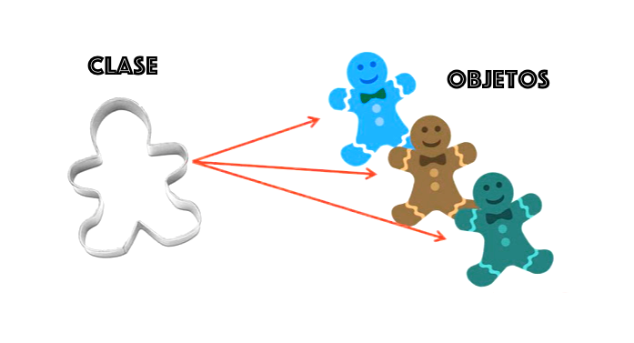

# TEORÍA POO

## PROGRAMACIÓN ORIENTADA A OBJETOS

La **Programación Orientada a Objetos** (POO) es un **paradigma de programación**. Se basa en el **concepto de clases y objetos**. Este tipo de programación se utiliza para estructurar un programa de software en piezas simples y reutilizables de planos de código (clases) para crear instancias individuales de objetos.&#x20;

## CLASES Y OBJETOS

<figure><figcaption>
Clases y Objetos
</figcaption></figure>

### Clase

Las clases son el componente sobre el que se fundamenta la Programación Orientada a Objetos.

Una clase es una plantilla para crear objetos. Las clases definen las propiedades de los objetos en base a:

#### Atributos

Son las variables que almacenan los diferentes datos que definen las características de un objeto.

#### Métodos

Son las funcionalidades que se pueden utilizar con los objetos de dicha clase.

### Objeto

Un objeto es una entidad independiente con sus propios datos y programación. Un menú, una ventana, una carpeta o un tipo de dato pueden ser considerados objetos. También puede serlo el motor de un coche.

Un **objeto**, en **Programación Orientada a Objetos**, es la **instancia** de una clase y consta de:

* **Estado.** Representado por los atributos del objeto, que reflejan sus propiedades.
* **Comportamiento.** Representado por los métodos del objeto, que reflejan su respuesta a otros objetos.
* **Identidad.** Cada objeto tiene un nombre único que le permite interactuar con otros objetos.


En definitiva, una clase es una plantilla y una instancia es una copia de la clase con valores determinados: un objeto.


## CARACTERÍSTICAS POO

{% embed url="https://es.wikibooks.org/wiki/Programaci%C3%B3n_Orientada_a_Objetos/Caracter%C3%ADsticas_de_la_POO" %}
Fuente: wikibooks



Lo que viene a continuación es la teoría que referenciaré cuando se realice la implementación práctica de dichas características.

Si no lo entiende ahora, no se preocupe, quedará más claro cuando vea la implementación práctica.


### Abstracción

El proceso de abstracción permite seleccionar las características relevantes dentro de un conjunto e identificar comportamientos comunes para definir clases.&#x20;

La abstracción es clave en el proceso de análisis y diseño orientado a objetos, ya que mediante ella podemos llegar a armar un conjunto de clases que permitan modelar la realidad.


La clave de la abstracción es saber qué atributos son indispensables para una clase y cuales son demasiado específicos.

Por ejemplo, si hago una clase para representar medios de transporte y pongo un atributo que sea "radioRuedasTraseras" esa clase no podrá referirse a la mayoría de medios de transporte marítimos.


### Encapsulamiento

Significa reunir todos los elementos que pueden considerarse pertenecientes a una misma entidad, al mismo nivel de abstracción. Esto permite aumentar la cohesión de los componentes del sistema.&#x20;

Para aplicar éste encapsulamiento se emplea conjuntamente con el principio de ocultación.

### Principio de Ocultación

Cada objeto está aislado del exterior y cada tipo de objeto expone una **interfaz** a otros objetos que especifica cómo pueden interactuar con los objetos de la clase.&#x20;

El aislamiento protege a las propiedades de un objeto contra su modificación por quien no tenga derecho a acceder a ellas. Solamente los propios métodos internos del objeto pueden acceder a su estado.&#x20;

Esto asegura que otros objetos no puedan cambiar el estado interno de un objeto de manera inesperada, eliminando efectos secundarios e interacciones inesperadas.

### Modularidad

Propiedad que permite subdividir una aplicación en partes más pequeñas (módulos), cada una de las cuales debe ser tan independiente como sea posible de la aplicación en sí y de las restantes partes.&#x20;

Estos módulos se pueden compilar por separado, pero tienen conexiones con otros módulos.

### Polimorfismo

Comportamientos diferentes, asociados a objetos distintos, pueden compartir el mismo nombre. Al llamarlos por ese nombre se utilizará el comportamiento correspondiente al objeto que se esté usando.

Este concepto va de la mano con el concepto de **Herencia**.

### Herencia

Las clases no están aisladas, sino que se relacionan entre sí, formando una jerarquía de clasificación. Los objetos heredan las propiedades y el comportamiento de todas las clases a las que pertenecen.&#x20;

La herencia organiza y facilita el polimorfismo y el encapsulamiento, permitiendo a los objetos ser definidos y creados como tipos especializados de objetos preexistentes. Estos pueden compartir (y extender) su comportamiento sin tener que volver a implementarlo.&#x20;

Cuando un objeto hereda de más de una clase se dice que hay herencia múltiple.

### Recolección de Basura

Es la técnica por la cual el entorno de objetos se encarga de destruir automáticamente, y por tanto desvincular la memoria asociada, los objetos que hayan quedado sin ninguna referencia a ellos.&#x20;

Esto significa que el programador no debe preocuparse por la asignación o liberación de memoria, ya que el entorno la asignará al crear un nuevo objeto y la liberará cuando nadie lo esté usando.


Esta característica no está implementada en todos los lenguajes de programación modernos como C++.

